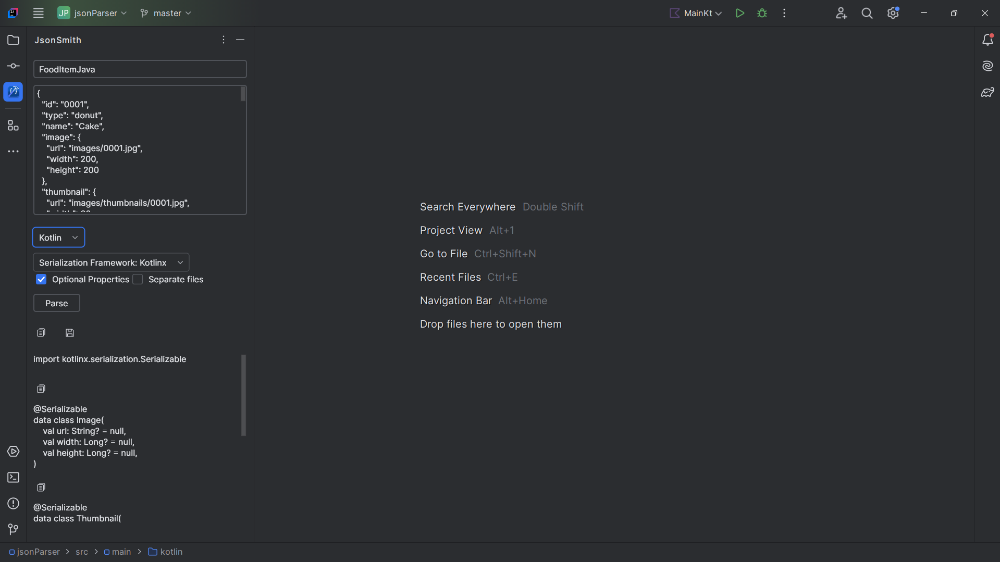
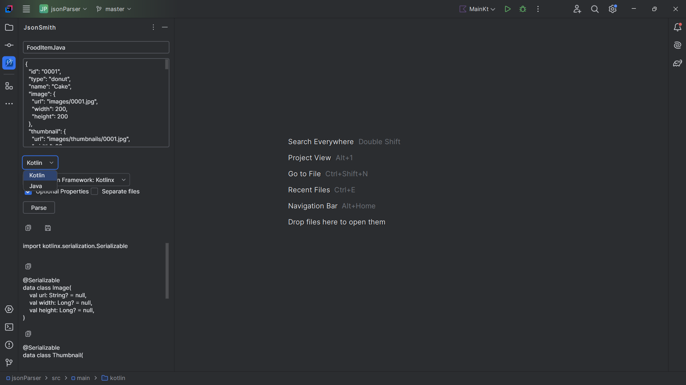
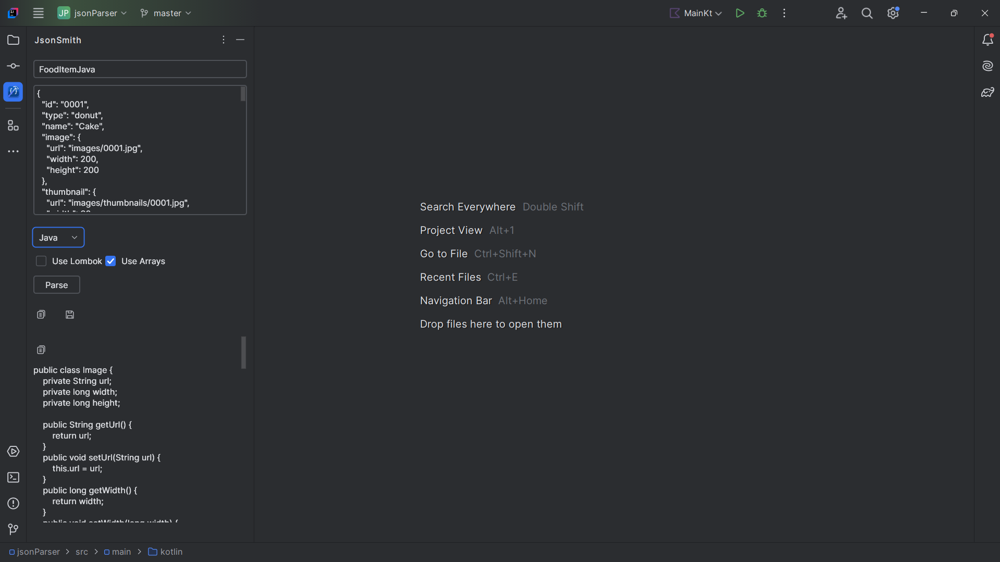
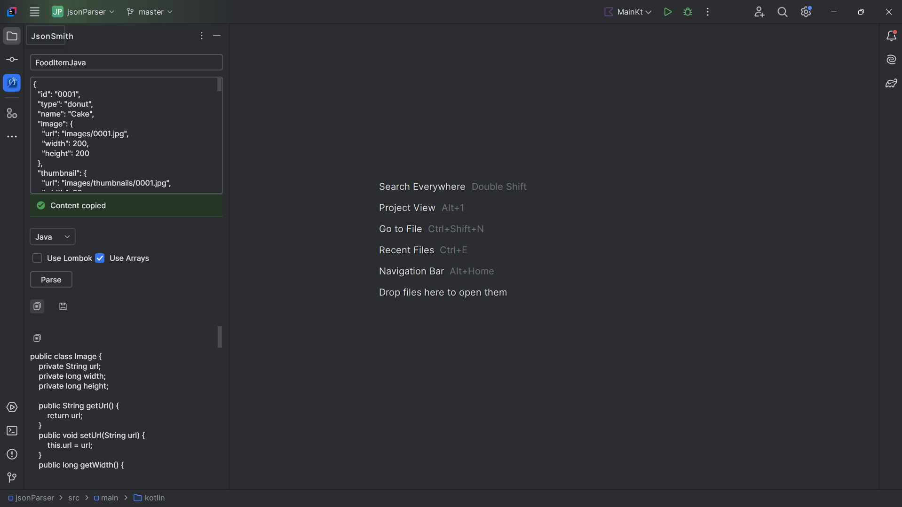

# JsonSmith

<!-- Plugin description -->
Generate classes/types from json strings.
 

Supported Languages:
 
### kotlin
  - kotlinx serialization
  - Gson
  - Jackson
  - Nullable or non-nullable properties
  - Save classes into separate or one file
   
### Java
  - Records (With jackson serializer)
  - Lombok (With jackson serializer)
  - Plain types (no serialization lib)
### Go
 
Features:
 - Generate classes/types and preview them before saving
 - Save generated types to your project or any folder on your computer
 - Copy all generated types or copy only the type/class you need
 - Easy configuration changes with Live preview
<!-- Plugin description end -->

## Installation

- Using the IDE built-in plugin system:
  
  <kbd>Settings/Preferences</kbd> > <kbd>Plugins</kbd> > <kbd>Marketplace</kbd> > <kbd>Search for "JsonSmith"</kbd> >
  <kbd>Install</kbd>
  
- Using JetBrains Marketplace:

  Go to [JetBrains Marketplace](https://plugins.jetbrains.com/plugin/MARKETPLACE_ID) and install it by clicking the <kbd>Install to ...</kbd> button in case your IDE is running.

  You can also download the [latest release](https://plugins.jetbrains.com/plugin/MARKETPLACE_ID/versions) from JetBrains Marketplace and install it manually using
  <kbd>Settings/Preferences</kbd> > <kbd>Plugins</kbd> > <kbd>⚙️</kbd> > <kbd>Install plugin from disk...</kbd>

- Manually:

  Download the [latest release](https://github.com/efe-egbevwie/JsonSmith/releases/latest) and install it manually using
  <kbd>Settings/Preferences</kbd> > <kbd>Plugins</kbd> > <kbd>⚙️</kbd> > <kbd>Install plugin from disk...</kbd>

---
Plugin based on the [IntelliJ Platform Plugin Template][template].

[template]: https://github.com/JetBrains/intellij-platform-plugin-template
[docs:plugin-description]: https://plugins.jetbrains.com/docs/intellij/plugin-user-experience.html#plugin-description-and-presentation

#### Previews

 

 

 

 

